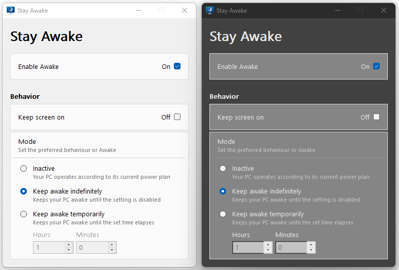

# Stay Awake (written in AutoHotkey)
Stay Awake is a utility tool for Windows designed to keep a computer awake without having to manage its power & sleep settings.

## Features
* Off (Passive) - The computer awakeness state is unaffected. The application is waiting for user input.
* Keep awake indefinitely - The computer stays awake indefinitely, until the user explicitly puts the machine to sleep or exits/disables the application.
* Keep awake temporarily - Keep machine awake for a pre-defined limited time. Once the time elapses, computer resumes its previous awakeness state.
* Keep screen on - While Awake can keep the computer awake indefinitely or temporarily, in its default state the displays connected to the machine will turn off, even though the computer won't go to sleep. If you need the displays to be available, use the Keep screen on switch, which will ensure that all monitors remain on.
* System tray - manage the execution of the tool from the system tray, right-click on the tray-icon.
* Settings Gui - manage the awakeness state of the computer.

## Examples

## Contributing
* thanks to AutoHotkey Community

## Inspired by
[Awake](https://docs.microsoft.com/en-us/windows/powertoys/awake) utility from PowerToys

## Questions / Bugs / Issues
If you notice any kind of bugs or issues, report them on the [AHK Thread](https://www.autohotkey.com/boards/viewtopic.php?t=95857). Same for any kind of questions.

## Copyright and License
[MIT License](LICENSE)

## Donations
[Donations are appreciated if I could help you](https://www.paypal.me/smithz)